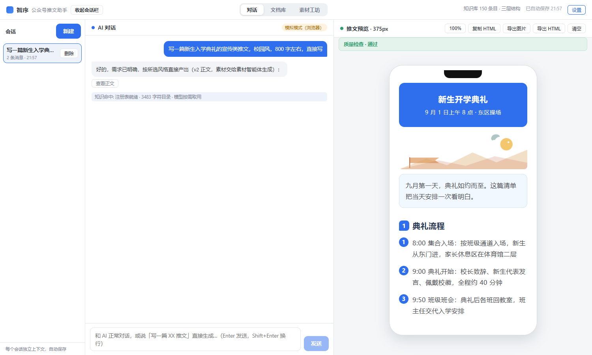
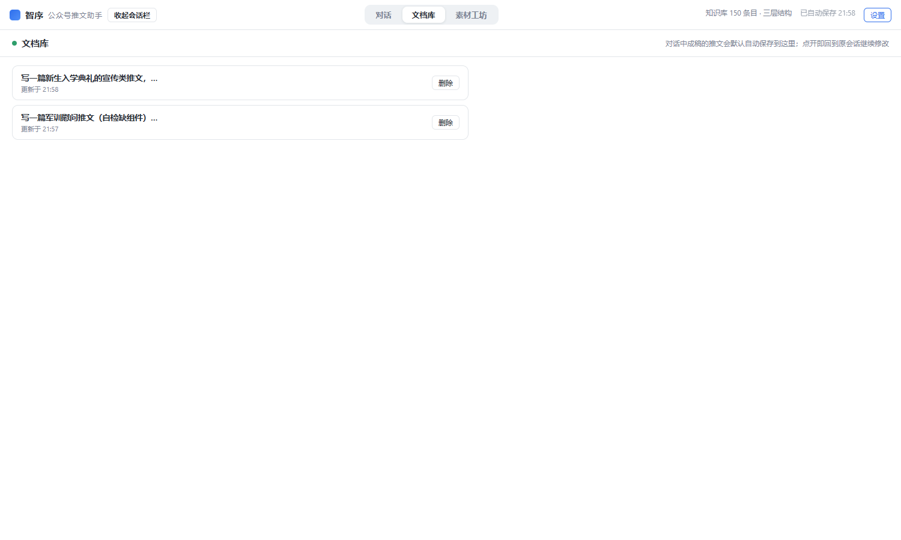
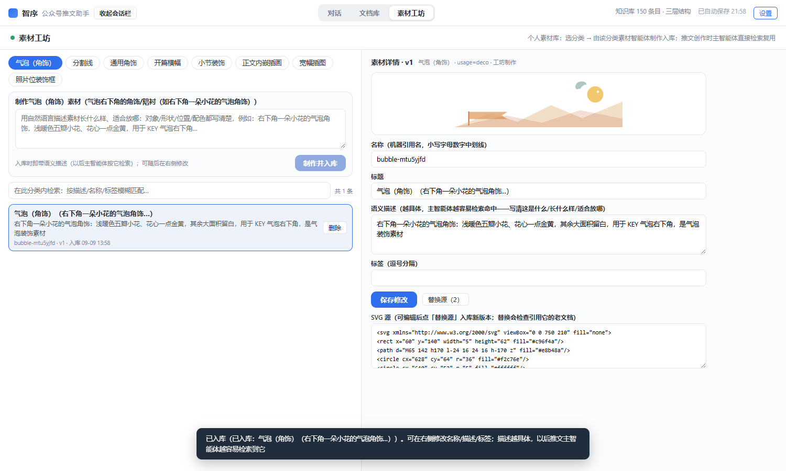

# 智序 · 公众号推文助手（桌面版）

智序（产品中文名，以下简称"公众号推文助手"）是一个跑在 Windows 电脑上的微信公众号写作工作台：左侧像聊天一样向 AI 提出需求，右侧 375px 手机屏实时预览排版成品。内置公众号排版知识库与排版引擎（v2），素材可入个人库反复复用，成稿自动存档、一键导出高清长图后手动上传发布。

技术栈：Tauri 2 + React 19 + TypeScript + Vite；AI 直连 DeepSeek API（流式）；不依赖任何云端框架与运行时，作品与数据全部保存在本机。

> 面向最终用户的完整图文教程在安装包内置《使用手册》（应用顶栏「使用手册」按钮，或程序目录 `使用手册.html`）。

## 界面预览

| 主工作台：对话创作 + 实时预览 | 文档库：成稿自动保存、随时打开续改 | 素材工坊：插画制作入库、检索复用 |
| --- | --- | --- |
|  |  |  |

## 主要特性

- **AI 对话创作**：自然语言提出需求，模型先澄清细节再成稿（仅靠 persona 约束、无前端状态机）；支持多轮修改、反问取消、闲聊。
- **公众号排版引擎**：内嵌三层知识语料（文本/视觉/插图/其它，149 条目）+ 引擎写作文档协议：小标题、提示气泡、分隔线、照片位、横幅与插图位等成套组件，统一 375px 手机版式渲染。
- **实时预览与质检**：右侧手机屏实时渲染；生成后自动质量门禁（组件不足/素材缺失等可修项自动回喂模型重写，最多两轮）。
- **个人素材库 + 素材工坊**：创作时不手写 SVG——先检索复用库内素材（`[[asset]]` 引用、语义检索、风格仅软参考）；缺料自动委托素材智能体现场制作并入库。气泡角饰/分割线/装饰/横幅/标题图/插图/相框等 8 类分类管理，支持替换源（version 版本化）与影响扫描（引用文档逐篇选择是否用新版更新，引用固化副本不被静默改动）。
- **文档库**：每篇成稿自动保存（源码 + 渲染快照），打开文档即回到源会话继续修改，就地刷新不产生两版。
- **导出发布**：一键导出 HTML，或 375 宽 2x（750 宽）高清长图 + 按屏分页 PNG（自动打开所在文件夹），由用户自行上传公众号后台发布（不代发）。
- **多会话管理**：会话侧栏新建/切换/删除，全部自动存档，重启不丢。
- **密钥安全**：DeepSeek API Key 仅存本机（环境变量或设置面板 → 文档目录 `settings.json`），绝不写入源码与仓库。

## 快速开始

### 直接使用（最终用户）

1. 获取 Windows 安装包（NSIS 产物 `智序_<版本>_x64-setup.exe`，如 `智序_0.1.0_x64-setup.exe`），双击安装（个人开发者未签名，SmartScreen 提示时选「更多信息 → 仍要运行」）。
2. 打开「公众号推文助手」，右上角「设置」填入你自己的 DeepSeek API Key（到 <https://platform.deepseek.com> 创建），保存。
3. 在输入框直接说想写什么即可。详细图文教程见软件内「使用手册」。

### 从源码开发

环境要求：Node.js ≥ 20（pnpm）、Rust stable、Windows 10/11（WebView2）。

```bash
pnpm install
pnpm dev          # 纯浏览器开发模式（本地 mock 对话，演示双栏链路，无需密钥）
pnpm tauri dev    # 桌面开发模式（Tauri 窗口 + Rust 直连 DeepSeek 流式调用）
```

打包 Windows 安装包（NSIS）：

```bash
pnpm tauri build --bundles nsis
# 产物：src-tauri/target/release/bundle/nsis/*-setup.exe
```

密钥解析顺序：环境变量 `DEEPSEEK_API_KEY` → 应用内设置（`文档/wechat-mp-workspace/settings.json`，桌面端）→ 浏览器 localStorage（开发模式）。端点/模型默认 `https://api.deepseek.com` / `deepseek-v4-flash`（请求带 `reasoning_effort: max`），可用 `DEEPSEEK_BASE_URL`、`DEEPSEEK_MODEL` 覆盖，也可在应用内「设置」修改。

## 验证

本项目的真实验证文化（勿跳步）：前端 UI 链路用 Playwright E2E 截图存证；排版引擎与质检用 compose 检查；Rust 用 cargo 单测 + 冒烟；关键行为另用真实模型 live 合规闸门。

```bash
pnpm build                                # tsc 类型检查 + vite 构建
cargo test --manifest-path src-tauri/Cargo.toml   # Rust 单测
node scripts/verify-ui.mjs                # 浏览器 E2E（S1-S14，截图入 docs/artifacts）
node scripts/compose-check.mjs            # 排版引擎合规样例检查
node scripts/live-conformance.mjs         # 真实模型合规闸门（需 DEEPSEEK_API_KEY，联网）
```

## 项目结构

```
├── src/                     # React 前端
│   ├── App.tsx              # 主状态与回合编排（含自动质检回路）
│   ├── lib/                 # persona / 知识检索 / 对话双通道 / v2 排版引擎 compose /
│   │                        # 素材解析 image-agent / 素材库 / 文档库 / 会话 / 修订 revise / 图片导出
│   ├── components/          # ChatPane / PreviewPane(375px) / SessionRail /
│   │                        # DocsPane / AssetWorkshop / SettingsPanel
│   └── knowledge/           # 三层知识语料（文本/视觉/插图/其它，随包内嵌）
├── src-tauri/               # Rust 后端
│   ├── src/                 # chat.rs(SSE 流式) / assets.rs / documents.rs / sessions.rs /
│   │                        # export.rs / manual.rs / publish.rs(已停用草稿发布) / settings.rs
│   ├── resources/           # 随安装包发布的资源（使用手册.html）
│   └── tauri.conf.json      # bundle.resources 打包配置
├── scripts/                 # E2E 与合规验证脚本（playwright）
├── docs/                    # 需求登记册见根 REQUIREMENTS.md；开发进度 PROGRESS(-LITE).md；
│                            # STRUCTURE.md；ai-context/ 注入素材；artifacts/ 截图存档
└── REQUIREMENTS.md          # 需求登记册（每轮先登记后开发）
```

## 数据与隐私

- 会话、推文文档、素材库、导出产物、设置全部存放在 `文档/wechat-mp-workspace/`（sessions / documents / assets / exports / settings.json），本机单用户，卸载软件不删除。
- 本软件无遥测、无统计上报；唯一外部网络通信为创作时调用 DeepSeek API（对话内容会发送给该服务商，请勿输入敏感个人信息）。
- 仓库不含任何真实密钥/凭据（密钥仅存用户本机），历史提交同样经过泄露扫描。

## 关联项目

- 本 GitHub 仓库名 wechat-mp：**main 分支 = 本桌面版项目**（智序）；**dsh 分支 = 旧版 DSH 公众号插件预设**（公众号推文助手插件预设，创作型 Agent 知识体系，已迁移保留）。
- 排版知识语料（`src/knowledge/`）源自本地 wechat-mp 预设三层知识库体系（文本/视觉/插图/其它），随桌面版独立演进。
- 本仓库为个人项目（无开源许可证），代码与文档体系仅供学习交流；如欲使用、分发或商用，请联系作者。

## 文档体系

每轮开发遵循「先登记后开发」：REQUIREMENTS.md 逐轮登记需求与验收标准；PROGRESS.md（详细）/ PROGRESS-LITE.md（精简）逐轮记录；STRUCTURE.md 维护目录结构；docs/ 承载注入素材、设计文档与验证截图存档。
